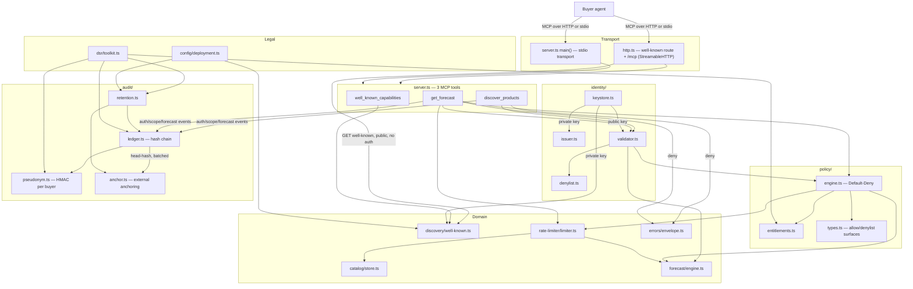

# Architecture

## Overview

Every buyer request flows through the same pipeline:

```
transport → authenticate → policy decision → rate limit → domain logic → response
                                    │                            │
                                    └──────────► audit ◄─────────┘
```

A separate, lower-traffic path (retention + data-subject-rights tooling) reads and manages the
audit ledger without ever touching the request pipeline.



## Request flow (`discover_products` / `get_forecast`)

1. **Authenticate** — if a token is present, validate signature → claims → denylist. An invalid
   or revoked token returns the same generic `AUTH_FAILED` as a policy deny, so a buyer can't
   distinguish "bad token" from "not entitled."
2. **Policy decision** — Default-Deny, evaluated in a fixed order: is the surface itself
   denylisted → does an entitlement exist for this buyer → does it cover this surface → scope →
   phase. Any failure denies.
3. **Rate limit** — checked (and only consumed) after a request has passed the first two steps.
4. **Domain logic** — synthetic catalog lookup or bucketized forecast. No real ad-server call
   exists yet.
5. **Response** — every meaningful step along the way (auth outcome, policy outcome, forecast
   request) is appended to the audit ledger, pseudonymizing the buyer identifier first.

## Public discovery path

`GET /.well-known/seller-mcp-capabilities` is intentionally unauthenticated: it's the trust
anchor a buyer agent reads *before* it can authenticate to anything else, so gating it behind
auth would be a bootstrapping deadlock. Its content is coarse by construction (capability list +
privacy posture) and the response is a signed, cacheable document — cheap to verify, cheap to
serve repeatedly.

## Audit chain

Every audit entry is pseudonymized before it's hashed into the chain, so the chain itself never
carries a raw buyer identifier. Entries are periodically anchored externally (a batched
head-hash write) so that tampering with the local ledger file alone isn't enough to rewrite
history undetected. Retention rotates old entries into an archived, still-anchored segment and
eventually purges their content while preserving the head hash — so old traffic can be proven to
have existed without keeping the raw payload forever.

## What doesn't exist yet

- **A live Google Ad Manager connection.** Catalog and forecast data are synthetic, loaded from
  local JSON config. The identity layer already issues tokens scoped for a future GAM adapter
  (`aud: gam-adapter`), but nothing consumes them yet.
- **Any write path.** There is no tool, and no planned tool, that can create or modify anything
  in an ad server from this project. It is read-only by design, not by current limitation.
- **Config-file-based entitlements.** Buyer entitlements are currently code fixtures; moving them
  to a JSON file (matching how catalog and deployment config already work) is planned.
