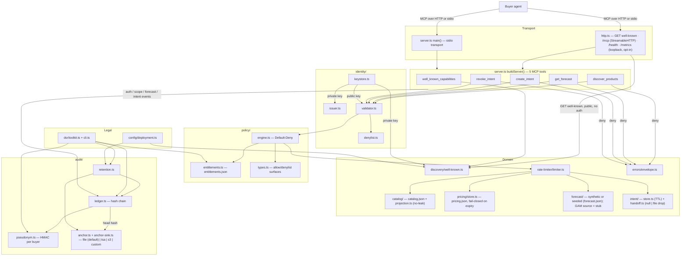

# Architecture

## Overview

Every buyer request flows through the same pipeline before any domain logic runs:

```
transport → replay guard → authenticate → policy decision → rate limit → domain logic → response
                                                   │                              │
                                                   └────────────► audit ◄─────────┘
```

Two lower-traffic paths run beside it and never inside a buyer request:

- **Background cycles** started at boot in `main()`: head-hash anchoring (plus, when the operator
  opts in, externalizing anchors to a TSA or S3), ledger retention and pseudonym-key shredding,
  and the intent TTL sweep.
- **Operator tooling**: token issuance/revocation scripts and the GDPR data-subject-rights CLI
  (shipped as the `gam-seller-dsr` bin).


```mermaid
flowchart TB
    BA[Buyer agent]

    subgraph Transport
        HTTP["http.ts — GET well-known · /mcp (StreamableHTTP) · /health · /metrics (loopback, opt-in)"]
        STDIO["server.ts main() — stdio transport"]
    end

    subgraph Core["server.ts buildServer() — 5 MCP tools"]
        T1[well_known_capabilities]
        T2[discover_products]
        T3[get_forecast]
        T4[create_intent]
        T5[revoke_intent]
    end

    subgraph Identity["identity/"]
        KS[keystore.ts]
        ISS[issuer.ts]
        VAL[validator.ts]
        DL[denylist.ts]
    end

    subgraph Policy["policy/"]
        PE[engine.ts — Default-Deny]
        ENT["entitlements.ts — entitlements.json"]
        PT[types.ts — allow/denylist surfaces]
    end

    subgraph Domain
        CAT["catalog/ — catalog.json + projection.ts (no-leak)"]
        PR["pricing/store.ts — pricing.json, fail-closed on expiry"]
        FC["forecast/ — synthetic or seeded (forecast.json); GAM source = stub"]
        INT["intent/ — store.ts (TTL) + handoff.ts (null | file drop)"]
        WK[discovery/well-known.ts]
        RL[rate-limiter/limiter.ts]
        ERR[errors/envelope.ts]
    end

    subgraph Audit["audit/"]
        LED[ledger.ts — hash chain]
        PSN[pseudonym.ts — HMAC per buyer]
        ANC["anchor.ts + anchor-sink.ts — file (default) | tsa | s3 | custom"]
        RET[retention.ts]
    end

    subgraph Legal
        DSR[dsr/toolkit.ts + cli.ts]
        DEP[config/deployment.ts]
    end

    BA -->|MCP over HTTP or stdio| HTTP & STDIO
    HTTP --> Core
    STDIO --> Core
    HTTP -->|GET well-known, public, no auth| WK

    T1 --> WK
    T2 & T3 & T4 & T5 --> VAL --> PE --> RL
    RL --> CAT & PR & FC & INT
    T2 & T3 & T4 & T5 -->|deny| ERR
    VAL --> DL
    PE --> ENT & PT

    Core -->|auth / scope / forecast / intent events| LED
    LED --> PSN
    LED -->|head hash| ANC
    RET --> LED & ANC

    KS -->|private key| ISS & WK
    KS -->|public key| VAL

    DSR --> ENT & LED & PSN & RET
    DEP --> WK & RET
```

## Request flow (authenticated tools)

`discover_products`, `get_forecast`, `create_intent` and `revoke_intent` are all registered through
one wrapper (`guardedTool` in `server.ts`), so no authenticated surface can skip a gate:

1. **Replay guard (SEC-GATE-3)** — a repeated `client_request_id` is rejected. The key is optional
   by default; `MCP_REQUIRE_IDEMPOTENCY_KEY` makes it mandatory (fail-closed).
2. **Authenticate** — a buyer token is **required** on every authenticated surface; there is no
   anonymous path (`require_auth: false` is not supported and refuses to boot). The token is
   validated (RS256 signature → claims with `aud=seller-mcp-node` → revocation denylist) and the
   buyer identity is the token's `sub`. There is no `buyer_id` input, so a buyer can only ever act
   as itself. An invalid or revoked token returns the same generic `AUTH_FAILED` as a policy deny.
3. **Policy decision** — Default-Deny, in a fixed order: surface denylisted → entitlement exists
   for this buyer (loaded from `entitlements.json`) → covers this surface → scope → phase. Any
   failure denies.
4. **Rate limit** — checked (and only consumed) after the first gates pass; every authenticated
   tool has its own limiter.
5. **Domain logic**
   - `discover_products`: the buyer's entitled families, projected field by field (unknown keys
     are dropped), each with its firm list price when one is configured and not expired.
   - `get_forecast`: a Low/Mid/High bucket from the synthetic source, or from operator-seeded
     numbers (`forecast.json`). Every result is labelled `synthetic: true`; the GAM
     ForecastService source exists as a stub that throws until a service account is provisioned.
   - `create_intent`: rejected unless `price_ref` equals the family's current firm price; records
     a buyer-scoped intent whose expiry is capped by the price's `valid_until`. Optionally
     delivered to the publisher's sales rails as a local JSONL drop (`MCP_INTENT_HANDOFF=file`),
     off the request path. Never a GAM order or an inventory hold.
   - `revoke_intent`: a buyer can withdraw only its own active intents.
6. **Audit** — every meaningful step (auth outcome, scope decision, forecast request, intent
   created/revoked/expired) is appended to the ledger, with the buyer identifier pseudonymized
   first.

## Public discovery path

`GET /.well-known/seller-mcp-capabilities` (and the `well_known_capabilities` tool) is
intentionally unauthenticated: it is the trust anchor a buyer agent reads *before* it can
authenticate to anything else, so gating it behind auth would be a bootstrapping deadlock. Its
content is coarse by construction (capability list + privacy posture) and the response is a
signed, cacheable document — cheap to verify, cheap to serve repeatedly.

## Audit chain

Every audit entry is pseudonymized before it is hashed into the chain, so the chain never carries
a raw buyer identifier (attribution fields sit outside the hash input by design — see
[ADR-4](adr/ADR-4.md)). Chain integrity is verified on startup, and a corrupt or tampered ledger
stops the node (fail-closed). The head hash is anchored on a periodic cycle to an append-only
sink: a local file by default, or — when the operator opts in via `MCP_ANCHOR_SINK` — an RFC 3161
timestamp authority, an S3 Object Lock bucket, or a custom sink module. Only the head hash / anchor
record leaves the process, and only from that background cycle.

Retention rotates old entries into an archived, still-anchored segment and eventually purges their
content while preserving the head hash, so old traffic can be proven to have existed without
keeping the raw payload forever. The same cycle crypto-shreds the pseudonym keys of buyers inactive
beyond the retention horizon.

## Configuration

Publisher-specific behaviour lives in JSON, resolved as `MCP_CONFIG_DIR/<file>` → `config/<file>`
→ the bundled `pilot-publisher` example (demo mode, announced on stderr, refused when
`MCP_REQUIRE_OPERATOR_CONFIG` is set): `deployment.json`, `catalog.json`, `entitlements.json`,
`pricing.json`, and the optional `forecast.json`. An invalid file always fails closed.

## What doesn't exist yet

- **A live Google Ad Manager connection.** Catalog and pricing come from operator config; the
  forecast is synthetic or operator-seeded. The identity layer already issues tokens scoped for a
  future GAM adapter (`aud: gam-adapter`), but nothing consumes them yet.
- **Any ad-server write.** The only write is a buyer's own soft commitment (`create_intent` /
  `revoke_intent`), which is never a GAM order or an inventory hold. Order creation, media buys and
  inventory reservation are on the permanent surface denylist.
